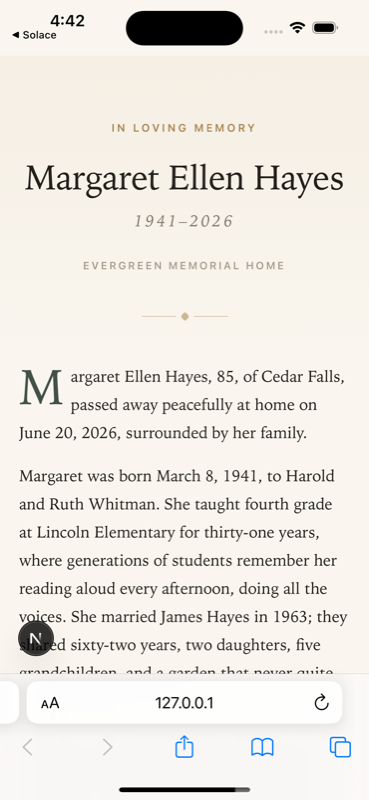
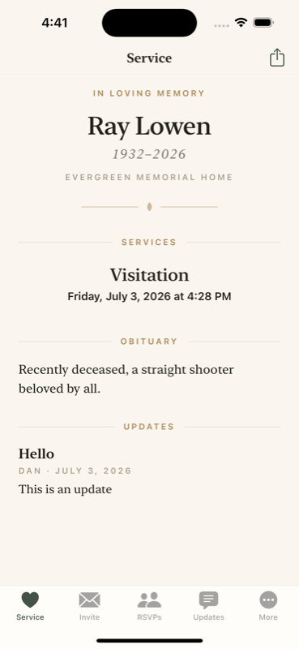
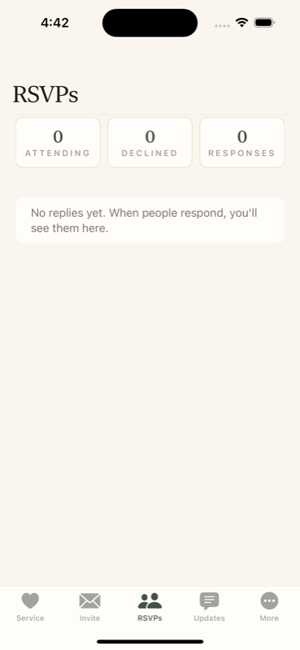

# Solace

[](https://github.com/dshipper/solace/actions/workflows/ci.yml)

**A gentle way for funeral homes to help families invite people to a service and manage the replies.**

When someone dies, a family member ends up with a brutal chore: telling everyone, one text at a time, and keeping track of who's coming. Solace turns that into three connected pieces:

- **Staff dashboard (web)** — the funeral home creates the event: obituary, photo, schedule of services. It produces a two-word **family code** on a printable card.
- **Family app (iOS)** — the family joins with the code, invites people straight from their phone's contacts, watches replies arrive, and posts updates ("reception moved to 1:00").
- **Invitee page (web)** — the person receiving a text just taps the link: a quiet memorial page with the schedule, directions, livestream link, and a reply form. No app, no account.

| The invitee's page | The family's app | Replies, live |
|:---:|:---:|:---:|
|  |  |  |

## The part that's deliberate, not decorative

Products in this space have a dark pattern available to them: harvest the grieving family's contact list and quietly turn it into a marketing database. Solace is built so that can't happen:

- **Contacts never leave the phone.** There is no endpoint that accepts address-book data — not opt-in, not opt-out, it does not exist. Invitations are sent by the family member, from their own phone, one message at a time (so invitees never see each other's numbers either).
- **Consent is individual and provable.** Invitees can tick a box to hear from the funeral home; it's unchecked by default, versioned (the exact wording is stored with each consent), timestamped, and email-only. The export contains only those people, and a public `/unsubscribe` page plus a staff-side suppression list always win over stale flags.
- **Everything is deletable.** Invitees can remove their reply, family members can leave (which deletes their record server-side), and staff can remove any reply, organizer, or the entire event.

The full contract — including the 14 binding amendments that came out of an adversarial design review — lives in [SPEC.md](SPEC.md).

## Try it in ten minutes

You need **Node 20+**. The web side runs anywhere; the iOS app needs a Mac with **Xcode** and **[XcodeGen](https://github.com/yonaskolb/XcodeGen)** (`brew install xcodegen`).

```bash
git clone https://github.com/dshipper/solace.git
cd solace
npm install
npm run seed    # creates a staff login and a demo event — note the family code it prints
npm run dev     # http://127.0.0.1:4863
```

The seed prints something like:

```
Created staff user dan@every.to (password: solace-demo-1)
Created demo event: Margaret Ellen Hayes
  Family code: CEDAR-WREN-4821
  Public page: http://127.0.0.1:4863/e/xxxxxxxxxx
```

### Demo script

**1. Be the funeral home.** Open [http://127.0.0.1:4863/admin](http://127.0.0.1:4863/admin), sign in with the seeded credentials, and open the demo event. This is the staff view: the family code as a ticket, a QR for the public page, the reply table, organizer management, and the marketing export (email-only, consented people only).

**2. Be the family.** Build and run the iOS app:

```bash
npm run ios:generate     # XcodeGen → ios/Solace.xcodeproj
open ios/Solace.xcodeproj   # run on an iPhone simulator from Xcode (⌘R)
```

Enter the family code and your name. Then try the **Invite** tab: pick a few of the simulator's sample contacts, review the list, and send — in the simulator each send falls back to a share sheet; on a real device it opens prefilled Messages composes, one per person.

**3. Be an invitee.** Open the public page (from the seed output) in a browser at phone width, scroll to **Reply**, and RSVP with a name and a fresh email. Note the two consent checkboxes — that's the whole compliance story in one screen.

**4. Watch it close the loop.** In the app, pull to refresh the **RSVPs** tab — your reply and the updated counts appear. Post something from the **Updates** tab, reload the public page, and it's there for every invitee.

## How it works

| Piece | Where | Notes |
|---|---|---|
| Domain logic + SQLite schema | `lib/` | Everything else is a thin adapter over this |
| Organizer + public JSON API | `app/api/` | Bearer tokens for the app, capability tokens for reply management |
| Public memorial/RSVP pages | `app/(public)/` | Server-rendered, no client framework beyond the forms |
| Staff dashboard | `app/admin/` | Session cookie + server actions, every action re-authenticates |
| iOS app | `ios/` | SwiftUI, iOS 17+, XcodeGen project, zero dependencies |

Next.js 15 + `better-sqlite3`, plain CSS, no analytics, no third-party scripts, no external fonts. Data lives in `./data/` (gitignored). A few invariants worth knowing before you change things:

- **Service times are wall-clock strings** (`YYYY-MM-DDTHH:mm`) end to end — never parsed into timezone-aware dates on any layer, so the funeral time can't silently shift between web and iOS.
- **Family organizers never see invitee contact info** — the organizer API strips email/phone; only staff see them.
- **Consent bookkeeping only moves when a consent value changes** — editing a guest count can't refresh (or backdate) a consent record.

## Tests

```bash
npm test                  # unit suite over the domain lib
npm run test:integration  # builds, boots the real server, runs full HTTP flows
npm run ios:test          # 42 iOS unit tests; the UI test skips without a live server
```

To run the iOS UI test for real (it joins the seeded event over HTTP): start the dev server, then
`SOLACE_TEST_FAMILY_CODE=<code> SOLACE_API_BASE=http://127.0.0.1:4863 npm run ios:test`.

## Status & roadmap

This is a working prototype: one funeral home per deployment, local SQLite, manual data-retention controls. Rough order of what's next:

- [ ] Deployment story (Postgres/Turso adapter, hosting config, HTTPS)
- [ ] Photo pipeline polish (seeded demo portrait, multiple photos per event)
- [ ] Scheduled retention (auto-purge invitee PII N days after the service)
- [ ] Push notifications for new replies (APNs)
- [ ] Multi-home tenancy for a hosted version
- [ ] App Store submission kit (review notes documenting the on-device contacts design)

Contributions welcome — read [SPEC.md](SPEC.md) first; the amendments section is binding, especially anything touching consent, contacts, or datetimes.
